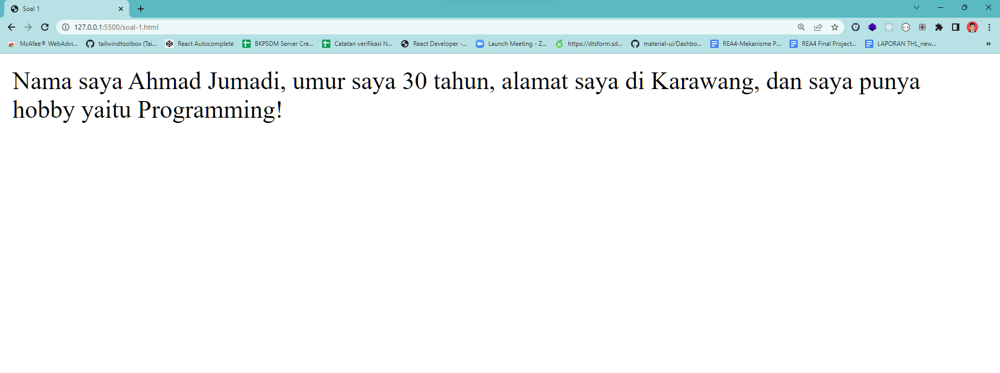

# SOAL 1

Tulislah sebuah function dengan nama introduce() yang memproses paramater yang dikirim menjadi sebuah kalimat perkenalan seperti berikut: "Nama saya [name], umur saya [age] tahun, alamat saya di [address], dan saya punya hobby yaitu [hobby]" !

```js
/* 
    Tulis kode function di sini
*/
// Isi data dengan data masing-masing
var data = {name : "John" , age : 30 , address : "Jalan Pelesiran" , hobby : "Gaming" }
 
var perkenalan = introduce(data);
document.write(perkenalan) // Menampilkan "Nama saya John, umur saya 30 tahun, alamat saya di Jalan Pelesiran, dan saya punya hobby yaitu Gaming" 

```
contoh hasilnya :

