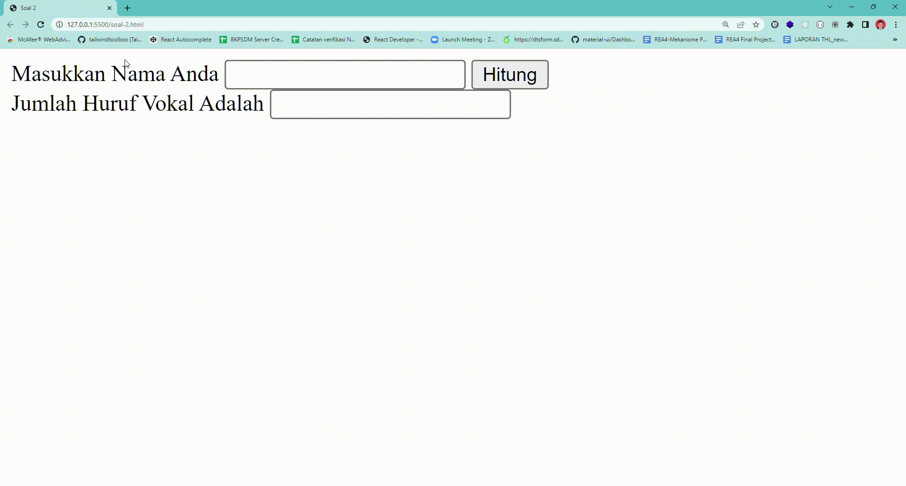

# SOAL 2

Tulislah sebuah function dengan nama *hitung_huruf_vokal()* yang menerima parameter sebuah string, kemudian memproses tersebut sehingga menghasilkan total jumlah huruf vokal dalam string tersebut.
kerjakan soal ini pada file soal-2.html
**kerjakan sesuai instruksi soal**

contoh hasinya :
